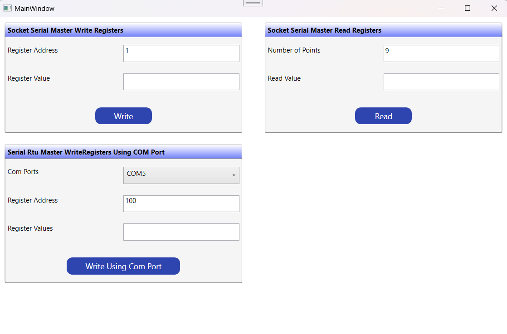
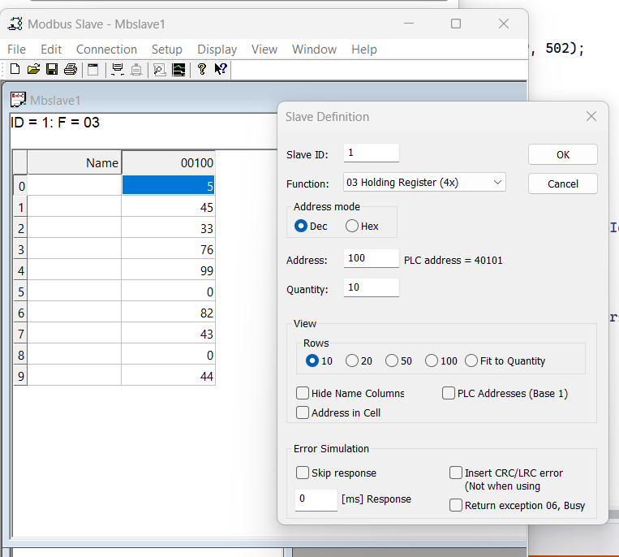
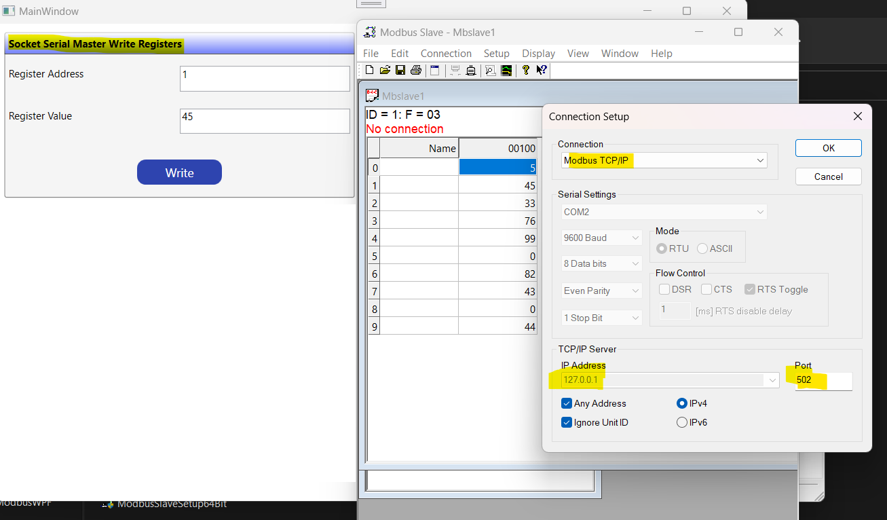
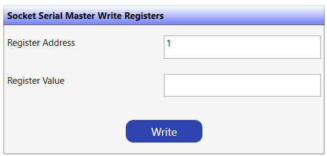
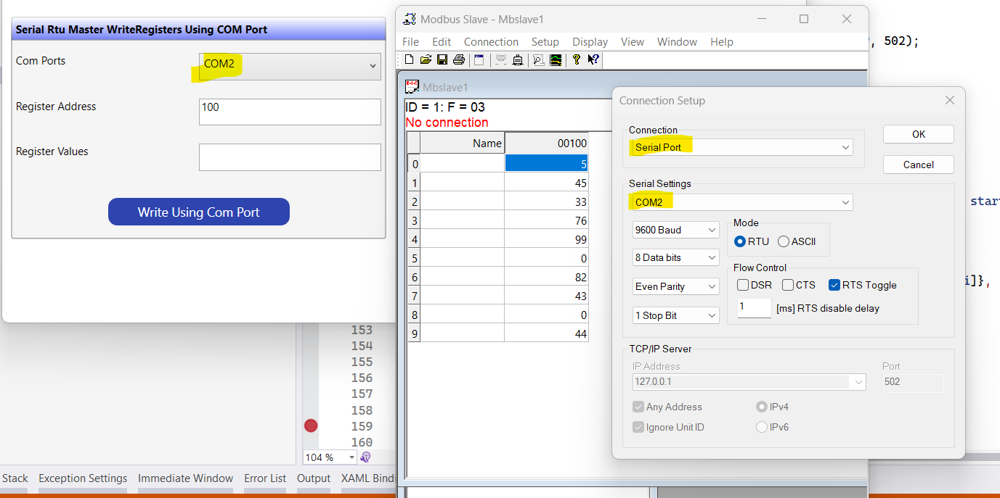

# Modbus
Modbus.org defined Modbus as follows...
> "MODBUS is an application-layer messaging protocol… It provides client/server communication between devices connected on different types of buses or networks."

According to WikiPedia...
> "Modbus is a data communications protocol originally published by Modicon (now Schneider Electric) in 1979 for use with its programmable logic controllers (PLCs). Modbus has become a de facto standard communication protocol and is now a commonly available means of connecting industrial electronic devices." [Read more](https://en.wikipedia.org/wiki/Modbus)

## How does a MODBUS work?
The devices which use MODBUS would communicate in a master/slave arrangement. In this type of communication, the master would communicate with one or multiple slaves. Mostly the master would be a PLC, PC, DCS, PAC, or RTU. The slaves are mostly the field devices, so in this configuration, the master would request to read or write a value. These values could be analog or digital, the slaves would respond to this request by giving the data to the master or by taking the action which is required. In case the slaves or Fieldbus wasn’t able to perform the requested action then the slave would create an error message and it would be transmitted to the master.

## Modbus Sample
This Modebus sample is the demonstration of how we can read and write into Registers using different Modbus communications types. 



We can use Modbus Simulator [https://www.modbustools.com/modbus_slave.html](url) to test the sample.
Here is the screenshot for configuring the  Modbus Slave Simulator.

 
 
This Sample application contains 3 sections. 

- **Socket Serial Master Read Registers**
  
  This is the example of reading values of Register's bit using Socket connection.
  
  
  
  ```C#
            using (var sock = new Socket(AddressFamily.InterNetwork, SocketType.Stream, ProtocolType.Tcp))
                {
                    // configure socket
                    var serverIP = IPAddress.Parse("127.0.0.1");
                    var serverFullAddr = new IPEndPoint(serverIP, 502);
                    sock.Connect(serverFullAddr);

                    var factory = new ModbusFactory();
                    IModbusMaster master = factory.CreateMaster(sock);

                    byte slaveId = 1;
                    ushort startAddress = 100;
                    ushort numInputs = ushort.Parse(numberOfPoints.Text);

                    ushort[] registers = master.ReadHoldingRegisters(slaveId, startAddress, numInputs);

                    var registersValues = string.Empty;
                    for (int i = 0; i < numInputs; i++)
                    {
                        registersValues += $"{(startAddress + i)}={registers[i]},  ";
                    }

                    ReadRegisterValues.Text = registersValues;
                }
  ```

- **Socket Serial Master Write Registers**
- 
  This is the example of Writing into Register's bit using Socket connection.
  
  ```C#
                using (var sock = new Socket(AddressFamily.InterNetwork, SocketType.Stream, ProtocolType.Tcp))
                {
                    // configure socket
                    var serverIP = IPAddress.Parse("127.0.0.1");
                    var serverFullAddr = new IPEndPoint(serverIP, 502);
                    sock.Connect(serverFullAddr);

                    var factory = new ModbusFactory();
                    IModbusMaster master = factory.CreateMaster(sock);

                    byte slaveId = 1;
                    ushort startAddress = ushort.Parse(RegisterAddress.Text);
                    ushort value = ushort.Parse(RegisterValue.Text);
                    master.WriteSingleRegister(slaveId, startAddress, value);          
                }
  ```
 
  
  

- **Serial Rtu Master WriteRegisters Using COM Port**
  
   This is the example of writing values of Register's bit using SerialPort connection. We are passing COM port.
  
   
  
   ```C#
            using (port = new SerialPort(comPorts.SelectedItem.ToString()))
            {
                // configure serial port
                port.BaudRate = 9600;
                port.DataBits = 8;
                port.Parity = Parity.None;
                port.StopBits = StopBits.One;
                port.Open();

                var factory = new ModbusFactory();
                IModbusMaster master = factory.CreateRtuMaster(port);

                byte slaveId = 1;
                ushort startAddress = ushort.Parse(RegisterAddress3.Text);
                var registerValues = RegisterValues3.Text;
                ushort[] registers = registerValues.Split(',').Select(ushort.Parse).ToArray();  

                master.WriteMultipleRegisters(slaveId, startAddress, registers);
            }
  ```
  

